# IMPLEMENTING A LAMP stack website on AWS Cloud.

Before we go into the business of creating A LAMP stack website on AWS, it is important we define it's various components. 

## WEB STACK

## What Does Web Stack Mean?
A web stack is usually comprised of: 
    • Operating system 
    • Database application 
    • Programming language 
    • Web server 
The operating system acts as the central interface between the hardware and software components. The web server helps in delivering the necessary documents to the clients who have requested them. Databases help in permanently storing volumes of data needed for the web project. The programming language or the script interpreter operates on the client side and helps realize dynamic web applications of websites. The collection of IT components in conjunction with proper server hardware helps in transferring essential information of the web projects to requesting clients. 
Numerous variations are possible with software components in a web stack and can thus serve different application needs. Frameworks also help in expanding the web stack capabilities by providing additional features such as additional programming languages or proxy servers. One of the best examples of a web stack, which we are going to implement shortky is the open-source bundle LAMP which makes use of Linux as the operating system, Apache as the web server, MySQL as the relational database management system and PHP as the object-oriented scripting language.

## LAMP’s Architecture

- Linux: Linux is the operating system and sits as the first layer of the LAMP stack. It is the backbone, as all other components run on top of it. Also, the programming language and database management used in developing an application must coincide with what platform to use. In this case, PHP, and MySQL work efficiently with Linux. On the other hand, SQL, ASP.NET, and ASP are better suited to Windows. Linux has an extensive worldwide user base that extends across different industries. Although developers can work with the rest of the stack components on different operating systems, Linux still dominates because of its flexibility and easy configuration options compared to other operating systems.
- Apache: Apache web server is the most widely used server in the world. It serves more than half of the websites on the Internet. Apache offers extensive support with its well-developed community. It works using the HTTP to process requests and send information over the Internet. Developers choose Apache for its mature and feature-rich ecosystem. Although there are other entrants such as NGINX, the choice depends on the application’s requirements. 
- MySQL: The third layer of the LAMP stack is the MySQL database. It is an open source relational database management system that stores application data. With MySQL, it stores all the information in a format that is easily queried using the SQL language. SQL language works well with a structured business domain. Also, MySQL is robust and proven suitable for running large and complex websites. It supports SQL and relational tables. By doing so, it enables developers to build dynamic enterprise-level databases.
- PHP: The last layer of the LAMP stack is the programming language. PHP (Hypertext Preprocessor) is a programming language that sits on this layer and has the role of combining all the elements of the LAMP stack. It allows web applications to run efficiently. The PHP language works with Apache to build dynamic web pages. Developers cannot use HTML alone to execute dynamic processes. It needs a programming language such as PHP to pull data out of a database. PHP executed this functionality by simply integrating PHP code into the parts of a page that needs to be dynamic. Note: PHP programming language is an efficient language. However, using the LAMP stack, developers can swap out PHP in favor of Perl or the increasingly favorite >

## How it Works?
Let us examine how these four layers interoperate using the high-level examination. The process starts when the Apache web server receives re>
For example, if the request is for a PHP file, then Apache passes the request to PHP. Next, it loads the file and executes the code. Meanwhil>
After that, PHP uses the code in the file and the data from the database. The browsers need this to create the HTML that browsers require to >
After running the file code, PHP passes the resulting data back to the Apache web server, then sends it to the browser. During this process, >

## PRE-REQUISITES FOR THIS PROJECT
1. Create and AWS and register an AWS account following [this instruction](https://aws.amazon.com/premiumsupport/knowledge-center/create-and-activate-aws-account/)
2. Set up an IAM user account and assign administration roles to it following these simple steps.
3. Create an IAM user account and assign assign administrative roles to the user. You can achieve this by following the steps below.
Type IAM in the searchobox, click on it and create an IAM user account

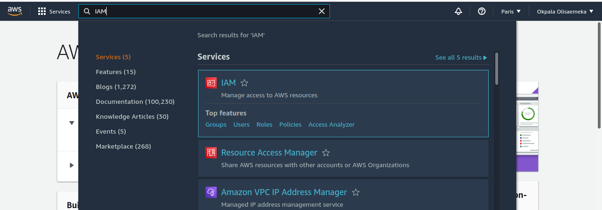

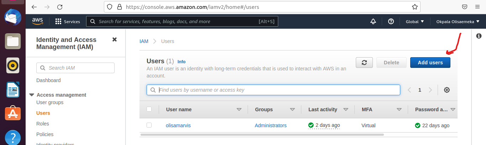

Add admin roles to the user, give it a name, create a custom password and download the csv file.

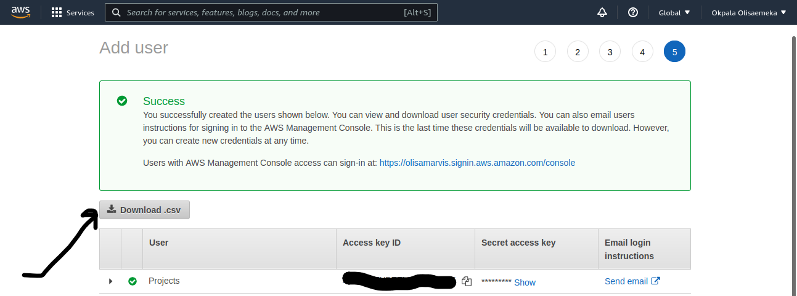

 Ensure you save those information securely and where you can always retrieve it when needed.
 
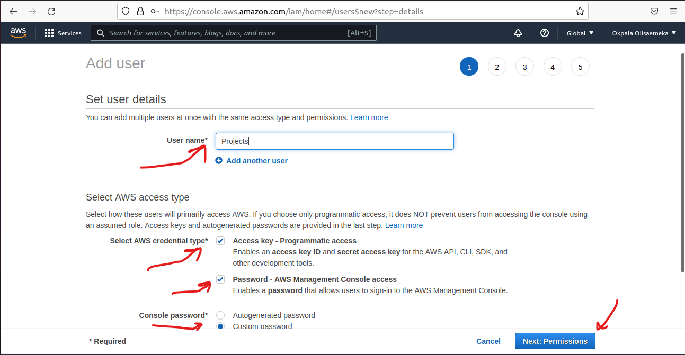

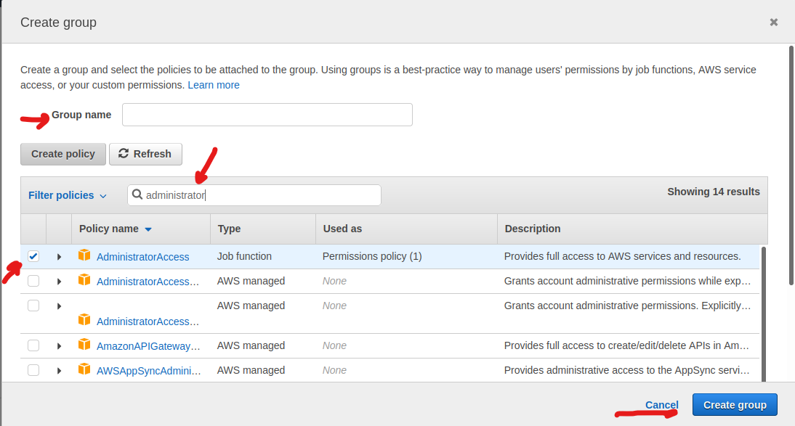

Click save and voila, you have created an IAM user account and you can now log out from your root account and log in with your IAM details.
I am building this LAMPSTACK website in AWS cloud using a linux OS. But before we get to that point I’ll first have to create a server where we will deploy our services.

##STAGE 1: Creating your EC2 Instance and using SSH to login from your terminal
Using our IAM user details, we login to AWS as an IAM user and search and launch and EC2 Instance. You can achieve this by following the steps below.

 securely and do not share it with anyone! If you lose it, you will not be able to connect to your server ever again!

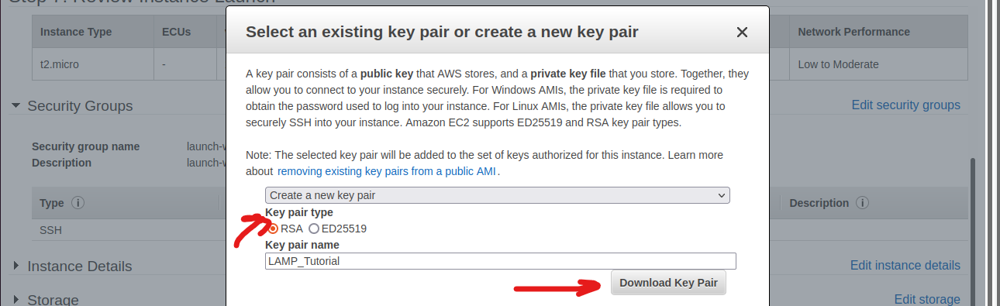

Once our instance is up and running. Its now time to connect to it from our terminal. But before we do that, we have to retrieve the public address of our EC2 instance. Watch the pictures and follow the instructions to copy the public IP address of your EC2 instance.


Now we move to the terminal in your linux OS.
- The terminal is already installed by default. You just need to open it up.
- We need the .pem key file which we saved from our EC2 downloaded from AWS.
- Change directory into the loacation where your PEM file is. Most likely will be in the Downloads folder

```
cd ~/Downloads
```
Copy the IP address and paste it on your terminal.
I’ll be using quotation marks to note information about details that needs to have an input. So anywhere I use quotation marks, kindly replace it with the appropriate information.
For example, if we need you to replace the name you have saved the private key on your machine, we will write something like **”private-key-name”**. If the name of my private key is lampstack.pem. The new private key will be **lampstack.pem**.
Now let’s continue.
Change premissions for the private key file (.pem), otherwise you can get an error “Bad permissions”

```
sudo chmod 0400 “private-key-name”.pem
```

Connect to the instance by running

```
ssh -i “private-key-name”.pem ubuntu@”Public-IP-address”
```
Let the image below serve as a guide.

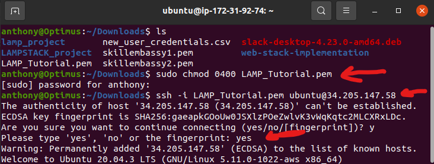

And voila!, we have connected to our linux instance from our terminal.

## STAGE 2: Installing Apache and Updating the Firewall

Install Apache using Ubuntu’s package manager [***‘apt’***](https://en.wikipedia.org/wiki/APT_(software)):

```
#update a list of packages in package manager
$ sudo apt update
#run apache2 package installation
$ sudo apt install apache2
```
To verify that apache2 is running as a Service in our OS, use following command
```
sudo systemctl status apache2
```

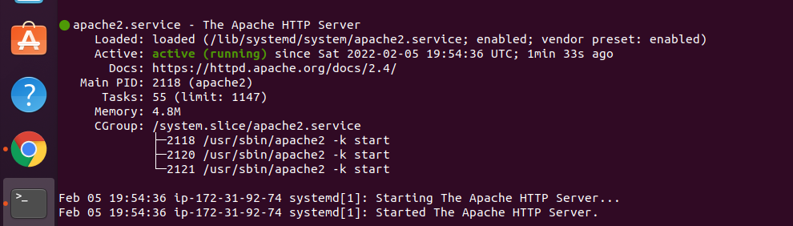

It is green and running, which means we did everything correctly. So we have just launched our first Web Server in the Clouds!
Before we can receive any traffic by our Web Server, we need to Open TCP port 80 which is the default port that web browsers use to access web pages on the Internet. 
As we know, we have TCP port 22 open by default on our EC2 machine to access it via SSH, so we need to add a rule to EC2 configuration to open inbound connection through port 80:
This is done by taking the gollowing steps
    • We first go to our EC2 instance and click on security
    • Then we click on security groups and edit inbound rules.
    • We click on the add rule button, change our type input to HTTP, change our source CIDR block to 0.0.0/0 to be able to receive inbound traffic from any IP address. Then click save.
    
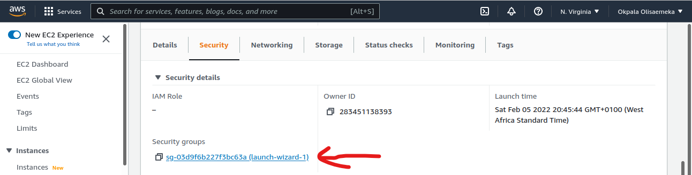


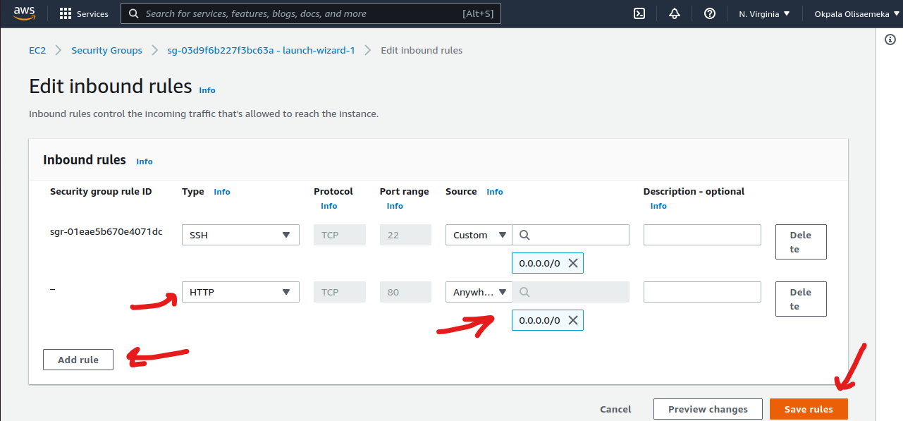

We can go a step further by enabling firewall on the server. We can achieve this by running the following commands.
```
sudo ufw enable
```

To allow Apache traffic we run the following command
```
sudo ufw allow "Apache"
```
To try and access our Apache server locally in our terminal we run the following command:
```
$ curl http://127.0.0.1:80
```
And then test if our Apache HTTP server can respond to requests from the Internet. To achieve this we open a web browser and try to access following url

```
http://”Public-IP-Address”:80
```
If you see following page, then your web server is now correctly installed and accessible through your firewall. 


This is exactly the same message we would get locally on our terminal using the curl command. But this time, the web browser uses HTML to give it a nice format.

## STAGE 3: Installing MYSQL
The next action is to install [MySQL](https://www.mysql.com/) on the the server. We can achieve this by running the following command

```
$ sudo apt install mysql-server
```

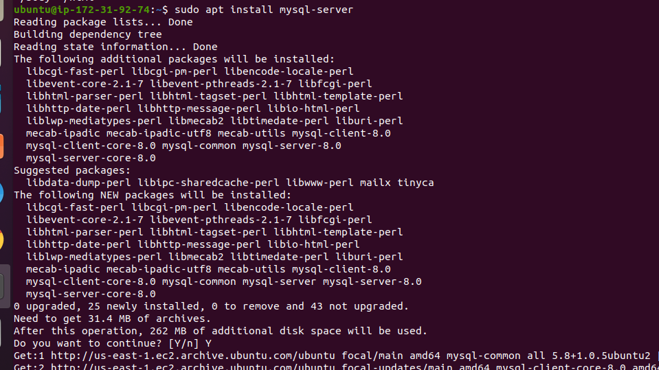

When prompted, confirm installation by typing <span style="color:blue">Y </span>, and then <span style="color:blue">ENTER </span>.
When the installation is finished, it’s recommended that you run a security script that comes pre-installed with MySQL. This script will remove some insecure default settings and lock down access to your database system. Start the interactive script by running:
```
$ sudo mysql_secure_installation
```
This will ask if you want to configure the <span style="color:red">VALIDATE PASSWORD PLUGIN </span>.

```
VALIDATE PASSWORD PLUGIN can be used to test passwords
and improve security. It checks the strength of password
and allows the users to set only those passwords which are
secure enough. Would you like to setup VALIDATE PASSWORD plugin?

Press y|Y for Yes, any other key for No:
```

If you answer “yes”, you’ll be asked to select a level of password validation. Keep in mind that if you enter <span style="color:red">2 </span> for the strongest level, you will receive errors when attempting to set any password which does not contain numbers, upper and lowercase letters, and special characters, or which is based on common dictionary words.

```
There are three levels of password validation policy:

LOW    Length >= 8
MEDIUM Length >= 8, numeric, mixed case, and special characters
STRONG Length >= 8, numeric, mixed case, special characters and dictionary              file

Please enter 0 = LOW, 1 = MEDIUM and 2 = STRONG: 1
```
In this project we chose 0 as we are just using this for a test.
But regardless of whether you chose to set up the  <span style="color:blue">VALIDATE PASSWORD PLUGIN </span>, your server will next ask you to select and confirm a password for the MySQL **root** user. This is not to be confused with the **system root**. The **database root** user is an administrative user with full privileges over the database system. Even though the default authentication method for the MySQL root user dispenses the use of a password, **even when one is set**, you should define a strong password here as an additional safety measure. We’ll talk about this in a moment.

If you enabled password validation, you’ll be shown the password strength for the root password you just entered and your server will ask if you want to continue with that password. If you are happy with your current password, enter <span style="color:red">Y </span> for “yes” at the prompt:

```
Estimated strength of the password: Can be 100 or 50 depending on the strenght of your own password. It’s 50 in this project.
Do you wish to continue with the password provided?(Press y|Y for Yes, any other key for No) : y
```

For the rest of the questions, press <span style="color:red">Y </span> and hit the  <span style="color:red">ENTER </span> key at each prompt. This will remove some anonymous users and the test database, disable remote root logins, and load these new rules so that MySQL immediately respects the changes you have made.


When you’re finished, test if you’re able to log in to the MySQL console by typing:
```
$ sudo mysql
```
This will connect to the MySQL server as the administrative database user **root**, which is inferred by the use of sudo when running this command. You should see output like this:

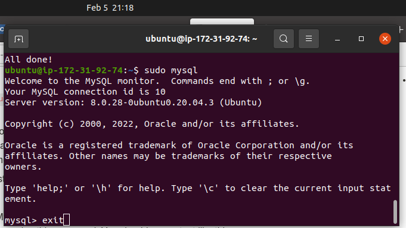

To exit the MySQL console, type:
```
mysql> exit
```
##STAGE 4: Installing PHP

[PHP](https://www.php.net/) is the component of our setup that will process code to display dynamic content to the end user. In addition to the <span style="color:red">php </span> package, you’ll need <span style="color:red">php-mysql </span>, a PHP module that allows PHP to communicate with MySQL-based databases. You’ll also need <span style="color:red">libapache2-mod-php </span> to enable Apache to handle PHP files. Core PHP packages will automatically be installed as dependencies.

To install these 3 packages at once, run:
```
$ sudo apt install php libapache2-mod-php php-mysql
```
Once the installation is finished, you can run the following command to confirm your PHP version:

```
php -v
```
You will see something like the picture below in your terminal

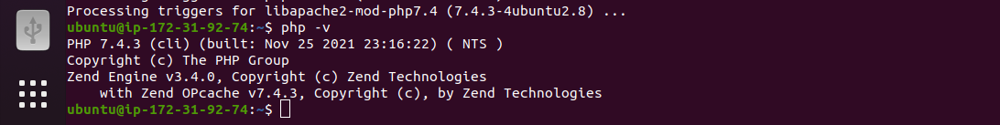


At this point, your LAMP stack is completely installed and fully operational.

- [x] Linux (Ubuntu)
- [x] Apache HTTP Server
- [x] MySQL
- [x] PHP

To test our setup with a PHP script, it’s best to set up a proper [Apache Virtual Host](https://httpd.apache.org/docs/2.4/vhosts/) to hold our website’s files and folders. Virtual host allows you to have multiple websites located on a single machine and users of the websites will not even notice it.
**Creating a Virtual Host for your Website using Apache**
In this project, we will set up a domain called <span style="color:red">projectlamp </span>, but you can replace this with any domain of your choice.

Apache on Ubuntu 20.04 has one server block enabled by default that is configured to serve documents from the **/var/www/html** directory. We will leave this configuration as is and will add our own directory next next to the default one.

Create the directory for <span style="color:red">projectlamp </span> using **‘mkdir’** command as follows:
```
$ sudo mkdir /var/www/projectlamp
```

Next, assign ownership of the directory with the <span style="color:red">$USER </span> environment variable, which will reference your current system user:
```
$ sudo chown -R $USER:$USER /var/www/projectlamp
```

Then, create and open a new configuration file in Apache’s <span style="color:red">sites-available </span> directory using your preferred command-line editor. Here, we’ll be using <span style="color:red">vi </span> or <span style="color:red">vim </span> (They are the same by the way):
```
$ sudo vi /etc/apache2/sites-available/projectlamp.conf
```

This will create a new blank file. Paste in the following bare-bones configuration by hitting on  or <span style="color:red">i </span> on the keyboard to enter the insert mode, and paste the text:
```
<VirtualHost *:80>
    ServerName projectlamp
    ServerAlias www.projectlamp 
    ServerAdmin webmaster@localhost
    DocumentRoot /var/www/projectlamp
    ErrorLog ${APACHE_LOG_DIR}/error.log
    CustomLog ${APACHE_LOG_DIR}/access.log combined
</VirtualHost>
```
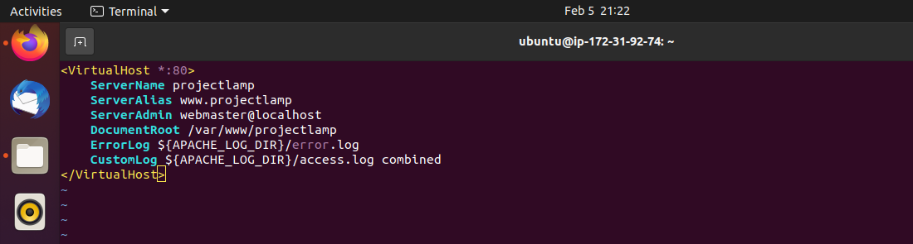

To save and close the file, simply follow the steps below:
```
1.Hit the esc button on the keyboard
2.Type :
3.Type wq. w for write and q for quit
4.Hit ENTER to save the file
```

You can use the <span style="color:red">ls </span> command to show the new file in the sites-available directory

```
$ sudo ls /etc/apache2/sites-available
You will see something like this
000-default.conf  default-ssl.conf  projectlamp.conf
```

With this VirtualHost configuration, we’re telling Apache to serve <span style="color:red">projectlamp </span> using **/var/www/projectlampl** as its web root directory. If you would like to test Apache without a domain name, you can remove or comment out the options ServerName and ServerAlias by adding a # character in the beginning of each option’s lines. Adding the # character there will tell the program to skip processing the instructions on those lines.

You can now use **a2ensite** command to enable the new virtual host:
```
$ sudo a2ensite projectlamp
```

You might want to disable the default website that comes installed with Apache. This is required if you’re not using a custom domain name, because in this case Apache’s default configuration would overwrite your virtual host. To disable Apache’s default website use **a2dissite** command , type:
```
$ sudo a2dissite 000-default
```

To make sure your configuration file doesn’t contain syntax errors, run:
```
$ sudo apache2ctl configtest
```

Finally, reload Apache so these changes take effect:

```
$ sudo systemctl reload apache2
```

Your new website is now active, but the web root **/var/www/projectlamp** is still empty. Create an index.html file in that location so that we can test that the virtual host works as expected:

```
sudo echo 'Hello LAMP from hostname' $(curl -s http://”169.254.169.254”/latest/meta-data/public-hostname) 'with public IP' $(curl -s http://”169.254.169.254”/latest/meta-data/public-ipv4) > /var/www/projectlamp/index.html
NB: Remember to replace the above quoted IP addresses with your public IP address of your EC2 instance.
```

Now go to your browser and try to open your website URL using IP address:
```
http://<Public-IP-Address>:80
```

If you see the text from **‘echo’** command you wrote to index.html file, then it means your Apache virtual host is working as expected. In the output you will see your server’s public hostname (DNS name) and public IP address. You can also access your website in your browser by public DNS name, not only by IP - try it out, the result must be the same (port is optional).
```
http://<Public-DNS-Name>:80
```
You should see something like the picture below when you refresh your browser

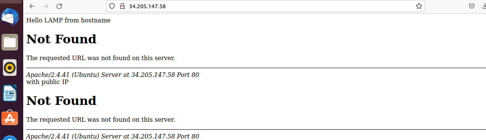

You can leave this file in place as a temporary landing page for your application until you set up an <span style="color:red">index.php </span> file to replace it. Once you do that, remember to remove or rename the <span style="color:red">index.html </span> file from your document root, as it would take precedence over an <span style="color:red">index.php </span> file by default.

**Enable PHP on the website**

With the default DirectoryIndex settings on Apache, a file named <span style="color:red">index.html </span> will always take precedence over an <span style="color:red">index.php </span> file. This is useful for setting up maintenance pages in PHP applications, by creating a temporary <span style="color:red">index.html </span> file containing an informative message to visitors. Because this page will take precedence over the <span style="color:red">index.php </span> page, it will then become the landing page for the application. Once maintenance is over, the <span style="color:red">index.html </span> is renamed or removed from the document root, bringing back the regular application page.

In case you want to change this behavior, you’ll need to edit the **/etc/apache2/mods-enabled/dir.conf** file and change the order in which the **index.php** file is listed within the **DirectoryIndex** directive:

```
sudo vim /etc/apache2/mods-enabled/dir.conf
```

```
<IfModule mod_dir.c>
        #Change this:
        #DirectoryIndex index.html index.cgi index.pl index.php index.xhtml index.htm
        #To this:
        DirectoryIndex index.php index.html index.cgi index.pl index.xhtml index.htm
</IfModule>
The end product must look like this in your terminal after editing the code
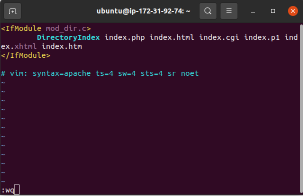
```

After saving and closing the file, you will need to reload Apache so the changes take effect:
```
$ sudo systemctl reload apache2
```

Finally, we will create a PHP script to test that PHP is correctly installed and configured on your server.

Now that you have a custom location to host your website’s files and folders, we’ll create a PHP test script to confirm that Apache is able to handle and process requests for PHP files.

Create a new file named <span style="color:red">index.php </span>  inside your custom web root folder:
```
$ vim /var/www/projectlamp/index.php
```

This will open a blank file. Add the following text, which is valid PHP code, inside the file:

```
<?php
phpinfo();
```
It should look like this when you have pasted or typed it in your terminal.

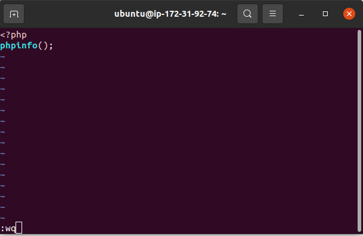

When you are finished, save and close the file, refresh the page and you will see a page similar to this:

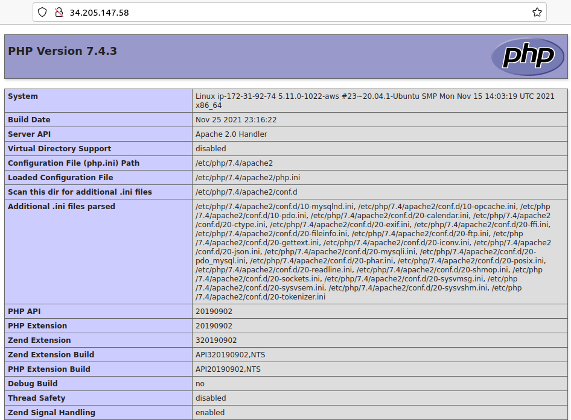

This page provides information about your server from the perspective of PHP. It is useful for debugging and to ensure that your settings are being applied correctly.

If you can see this page in your browser, then your PHP installation is working as expected.

After checking the relevant information about your PHP server through that page, it’s best to remove the file you created as it contains sensitive information about your PHP environment -and your Ubuntu server. You can use <span style="color:red">rm </span> to do so:
```
$ sudo rm /var/www/projectlamp/index.php
```

You can always recreate this page if you need to access the information again later.
Congratulations, if you followed me and successfully done all the above tasks, you have just deployed A LAMP stack website in AWS Cloud!

credit: [This guide was inspired by Skill Embassy](https://github.com/samuelbartels20/web-stack-implementation)
